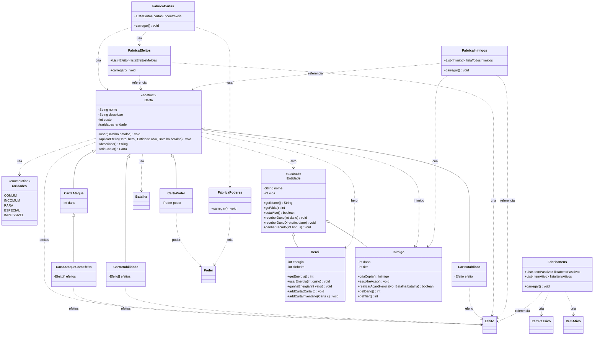

```mermaid
classDiagram

    class Carta {
        <<abstract>>
        -String nome
        -String descricao
        -int custo
        #raridades raridade
        +usar(Batalha batalha) void
        +aplicarEfeito(Heroi heroi, Entidade alvo, Batalha batalha) void
        +descricao() String
        +criaCopia() Carta
    }

    class raridades {
        <<enumeration>>
        COMUM
        INCOMUM
        RARA
        ESPECIAL
        IMPOSSIVEL
    }

    class CartaAtaque {
        -int dano
    }

    class CartaAtaqueComEfeito {
        -Efeito[] efeitos
    }

    class CartaHabilidade {
        -Efeito[] efeitos
    }

    class CartaMaldicao {
        -Efeito efeito
    }

    class CartaPoder {
        -Poder poder
    }

    class Efeito {
    }

    class Poder {
    }

    class Entidade {
        <<abstract>>
        -String nome
        -int vida
        +getNome() String
        +getVida() int
        +estaVivo() boolean
        +receberDano(int dano) void
        +receberDanoDireto(int dano) void
        +ganharEscudo(int bonus) void
    }

    class Heroi {
        -int energia
        -int dinheiro
        +getEnergia() int
        +usarEnergia(int custo) void
        +ganhaEnergia(int valor) void
        +addCarta(Carta c) void
        +addCartaInventario(Carta c) void
    }

    class Inimigo {
        -int dano
        -int tier
        +criaCopia() Inimigo
        +escolheAcao() void
        +realizarAcao(Heroi alvo, Batalha batalha) boolean
        +getDano() int
        +getTier() int
    }

    class Batalha {
    }

    class FabricaCartas {
        +List~Carta~ cartasEncontraveis
        +carregar() void
    }

    class FabricaEfeitos {
        +List~Efeito~ listaEfeitosMoldes
        +carregar() void
    }

    class FabricaInimigos {
        +List~Inimigo~ listaTodosInimigos
        +carregar() void
    }

    class FabricaItens {
        +List~ItemPassivo~ listaItensPassivos
        +List~ItemAtivo~ listaItensAtivos
        +carregar() void
    }

    class FabricaPoderes {
        +carregar() void
    }

    class ItemAtivo {
    }

    class ItemPassivo {
    }

    Carta <|-- CartaAtaque
    CartaAtaque <|-- CartaAtaqueComEfeito
    Carta <|-- CartaHabilidade
    Carta <|-- CartaMaldicao
    Carta <|-- CartaPoder
    Entidade <|-- Heroi
    Entidade <|-- Inimigo

    Carta ..> raridades : usa
    Carta ..> Efeito : efeitos
    Carta ..> Entidade : alvo
    Carta ..> Heroi : heroi
    Carta ..> Inimigo : inimigo
    Carta ..> Batalha : usa

    CartaAtaqueComEfeito ..> Efeito : efeitos
    CartaHabilidade ..> Efeito : efeitos
    CartaMaldicao ..> Efeito : efeito
    CartaPoder ..> Poder : poder

    FabricaCartas ..> Carta : cria
    FabricaCartas ..> FabricaEfeitos : usa
    FabricaCartas ..> FabricaPoderes : usa
    FabricaEfeitos ..> Efeito : cria
    FabricaEfeitos ..> Carta : referencia
    FabricaInimigos ..> Inimigo : cria
    FabricaInimigos ..> Carta : referencia
    FabricaInimigos ..> Efeito : referencia
    FabricaItens ..> ItemPassivo : cria
    FabricaItens ..> ItemAtivo : cria
    FabricaItens ..> Efeito : referencia
    FabricaPoderes ..> Poder : cria
```