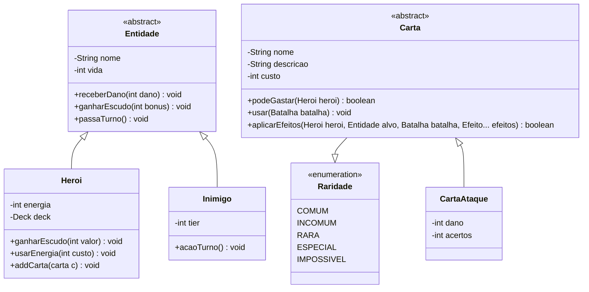

```mermaid
classDiagram

    class Entidade {
        <<abstract>>
        -String nome
        -int vida
        +receberDano(int dano) void
        +ganharEscudo(int bonus) void
        +passaTurno( ) void
    }

    class Carta {
        <<abstract>>
        -String nome
        -String descricao
        -int custo
        +podeGastar(Heroi heroi) boolean
        +usar(Batalha batalha) void
        +aplicarEfeitos(Heroi heroi, Entidade alvo, Batalha batalha, Efeito... efeitos) boolean
    }

    class Raridade {
        <<enumeration>>
        COMUM
        INCOMUM
        RARA
        ESPECIAL
        IMPOSSIVEL
    }

    class CartaAtaque {
        -int dano
        -int acertos
    }

    class Heroi {
        -int energia
        -Deck deck
        +ganharEscudo(int valor) void
        +usarEnergia(int custo) void
        +addCarta(carta c) void
    }

    class Inimigo {
        -int tier
        +acaoTurno( ) void
    }

    Entidade <|-- Heroi
    Entidade <|-- Inimigo
    Carta --|> Raridade
    Carta <|-- CartaAtaque
```